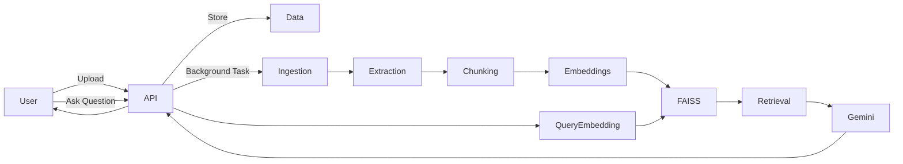

# 🚀 RAG-Based Question Answering System

## 📌 Overview

This project implements a **Retrieval-Augmented Generation (RAG)** system that allows users to upload documents and ask questions based on their content.

Unlike traditional LLMs, which may hallucinate, this system ensures **grounded and factual answers** by retrieving relevant document chunks before generating responses.

---

## 🎯 Objective

Build an applied AI system that combines:

* 📄 Document Processing
* 🔍 Semantic Search (Embeddings + FAISS)
* 🤖 LLM-based Answer Generation (Google Gemini)

---

## ⚙️ Key Features

* ✅ Upload documents (**PDF & TXT**)
* ✅ Asynchronous document ingestion (FastAPI BackgroundTasks)
* ✅ Token-based chunking with overlap
* ✅ Local embeddings using SentenceTransformers
* ✅ Fast similarity search using FAISS
* ✅ Context-aware answer generation using Gemini API
* ✅ Source attribution with similarity scores
* ✅ Latency tracking for performance analysis
* ✅ Request validation using Pydantic
* ✅ Rate limiting for API protection

---

## 🧠 What is RAG?

**Retrieval-Augmented Generation (RAG)** works in two steps:

1. **Retrieve** → Find relevant document chunks using embeddings
2. **Generate** → Use an LLM to answer using ONLY retrieved context

👉 This reduces hallucination and improves accuracy.

---

## 🏗️ System Architecture



---

## 📂 Project Structure

```bash
.
├── app/
│   ├── routes/
│   ├── services/
│   ├── utils/
│   ├── models/
│   └── main.py
├── data/
├── vector_store/
├── requirements.txt
├── .env.example
├── README.md
```

---

## 🛠️ Tech Stack (Why These?)

| Technology           | Purpose                         |
| -------------------- | ------------------------------- |
| FastAPI              | High-performance backend API    |
| SentenceTransformers | Local embedding generation      |
| FAISS                | Fast vector similarity search   |
| Google Gemini API    | Answer generation               |
| Pydantic             | Request validation              |
| python-dotenv        | Environment variable management |

---

## ⚡ Setup Instructions

### 1. Clone Repo

```bash
git clone https://github.com/saurabh-vit/RAG-Based-Question-Answering-System.git
cd RAG-Based-Question-Answering-System
```

### 2. Create Virtual Environment

```bash
python -m venv venv
venv\Scripts\activate   # Windows
```

### 3. Install Dependencies

```bash
pip install -r requirements.txt
```

### 4. Setup Environment Variables

Create `.env` file:

```env
GOOGLE_API_KEY=your_api_key_here
```

---

### 5. Run Server

```bash
python -m uvicorn app.main:app --reload --port 9000
```

👉 Open: http://127.0.0.1:9000/docs

---

## 🔌 API Endpoints

### 📄 Upload Document

```http
POST /upload
```

**Input:** PDF/TXT file
**Output:**

```json
{
  "document_id": "abc123",
  "status": "accepted"
}
```

---

### ❓ Ask Question

```http
POST /ask
```

**Request:**

```json
{
  "question": "How many recruitment agencies are listed?",
  "document_ids": ["abc123"],
  "top_k": 3
}
```

**Response:**

```json
{
  "answer": "50 recruitment agencies are listed.",
  "sources": [...],
  "latency_ms": 45
}
```

---

## 🔍 Chunking Strategy (MANDATORY)

* Chunk Size: **400 tokens**
* Overlap: **80 tokens**

### Why?

* Captures full context (paragraph-level meaning)
* Prevents information loss at chunk boundaries
* Improves retrieval accuracy

---

## ❌ Retrieval Failure Case (MANDATORY)

### Problem:

Query: *“How many agencies are listed?”*

### Issue:

System retrieves wrong section (e.g., marketing instead of recruitment agencies)

### Reason:

* Ambiguous query
* Similar terms across sections

### Solution:

* Add metadata (headings)
* Hybrid search (BM25 + embeddings)
* Re-ranking model

---

## 📊 Metrics Tracked (MANDATORY)

### 1. Latency

* Measured in `latency_ms`
* Helps optimize performance

### 2. Similarity Score

* Indicates relevance of retrieved chunks
* Helps debug retrieval quality

---

## ⚠️ Limitations

* Depends on external Gemini API
* Retrieval errors for ambiguous queries
* Latency varies based on API/network

---

## 🚀 Future Improvements

* Hybrid search (BM25 + FAISS)
* Re-ranking models
* Response caching
* Better UI (Streamlit enhancement)
* Multi-document reasoning

---

## 🏁 Conclusion

This project demonstrates a **production-level RAG system** with:

* End-to-end document processing pipeline
* Efficient retrieval using FAISS
* Grounded answer generation using Gemini
* Performance tracking and validation

---

## 📎 Deliverables

* ✅ GitHub Repository
* ⏳ Architecture Diagram
* ⏳ Demo Video

---

## 👨‍💻 Author

**Saurabh Raj**

---

## ⭐ Final Note

This system showcases real-world AI system design including:

> Upload → Chunk → Embed → Retrieve → Generate

👉 A complete **end-to-end RAG pipeline**

---
